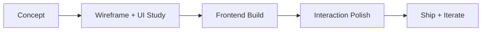

<div align="center">


<br/>
<br/>


<p>
  <a href="#-project-grid"></a>
  <a href="#-connect-terminal"></a>
  <a href="https://github.com/KevClint"></a>
</p>

</div>

---

<table>
<tr>
<td width="62%" valign="top">

## SYSTEM PROFILE

```yaml
name: Clint Lorenzo
role: Frontend Developer + Project Builder
focus: Responsive systems, typography, practical product delivery
philosophy: "Make every version cleaner than the last."
status: Building in public
```

I turn concepts into production-ready interfaces with strong visual hierarchy and usable interaction patterns.

</td>
<td width="38%" valign="top">

## LIVE SIGNALS


<br/>

<br/>

<br/>


</td>
</tr>
</table>

---

## TECH ARSENAL

<p>
  
</p>

<details>
<summary><b>Stack Breakdown</b></summary>
<br/>

| Layer | Tools |
|---|---|
| Languages | HTML, CSS, JavaScript, PHP |
| Frontend | React, Electron.js |
| Backend / Data | XAMPP, MySQL |
| Dev Workflow | Git, GitHub, Vercel, VS Code |

</details>

---

## PROJECT GRID

<details open>
<summary><b>MediaDL</b> � GUI media downloader powered by ytdlp + ffmpeg</summary>
<br/>


</details>

<details>
<summary><b>GameDock</b> � Lightweight desktop launcher integrated with Windows taskbar flow</summary>
<br/>


</details>

<details>
<summary><b>SnapCam</b> � Desktop camera alternative with pro-style controls</summary>
<br/>


</details>

<details>
<summary><b>InfoBot</b> � Unified AI dashboard with multi-provider model switching</summary>
<br/>


</details>

<details>
<summary><b>CodeDojo</b> � Browser-based platform for hands-on beginner HTML training</summary>
<br/>


</details>

<details>
<summary><b>Artfolio</b> � Visual-first platform for collecting independent creator artwork</summary>
<br/>

`Focus:` Discovery, curation, and clean presentation surfaces.

</details>

<details>
<summary><b>Sanctum</b> � Private AI comfort space with no account barrier</summary>
<br/>

`Focus:` Lightweight emotional support UX with instant conversational access.

</details>

---

## BUILD PIPELINE



---

## LEARNING LOG

<table>
<tr>
<td>

### Education

| Level | Institution |
|---|---|
| Senior High School | Zamboanga Del Sur National High School |
| Junior High School | Zamboanga Del Sur National High School |
| Elementary School | Pagadian City Pilot School |

</td>
<td>

### Certifications

- Computer Hardware Basics (Cisco)
- JavaScript Essential 1 (Cisco)
- Computer System Servicing NC2 (TESDA)
- Developing Designs for User Interface NC3 (TESDA)
- Hour of Code (Code.org)

</td>
</tr>
</table>

---

## METRICS PANEL

<div align="center">


</div>

---

## CONNECT TERMINAL

```bash
# handshake channel
kevlarclint@gmail.com

# github node
https://github.com/KevClint
```

<div align="center">

**Design with intent. Build with structure. Ship with clarity.**

</div>

